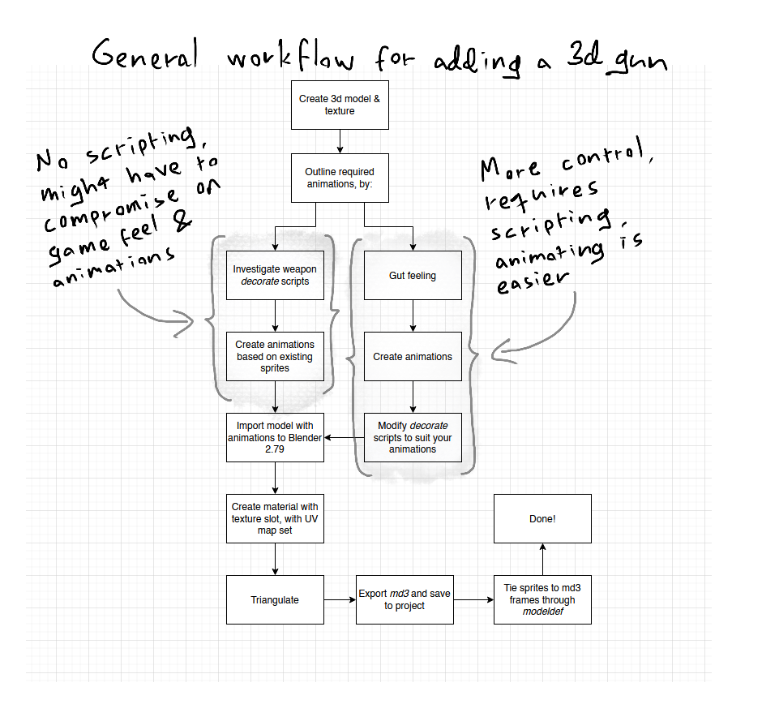
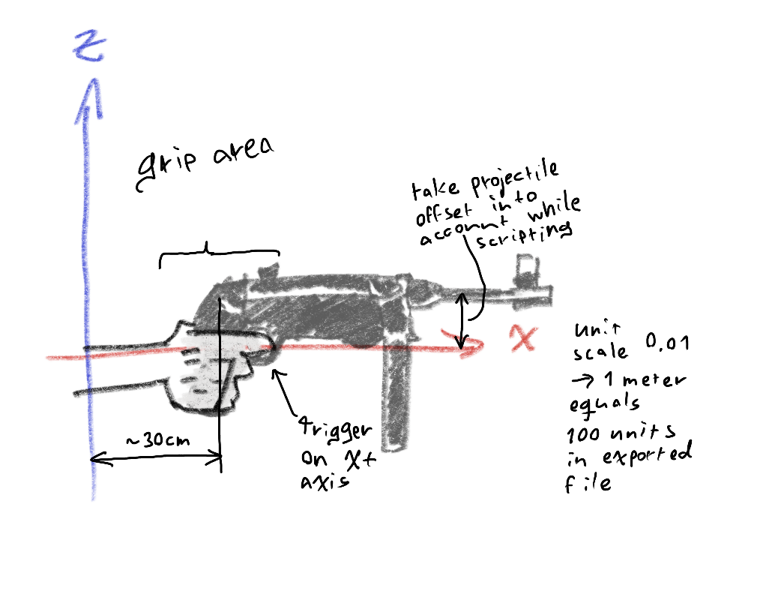

# Table of Contents

- [General](#general)
- [Modeling](#modeling)
  - [MD3](#md3)
  - [Trenchgun example](#trenchgun-example)
- [Exporting](#exporting)
  - [Exporting with Blender 2.79](#exporting-with-blender-2.79)
  - [Modeldef](#modeldef)
- [Scripting](#scripting)
  - [Hints](#hints)
  - [Sample actor](#sample-actor)

# General

The following diagram describes the process for adding an animated 3d model to an existing Doom weapon: 

The process can be done in two ways: investigate what sprites are used for weapon animations, then recreate the sprites as animation frames and tie each frame to an existing sprite.

The other way is to just animate your 3d model, and then modify the scripts to use your animation frames.

The first method "is/might be easier", and only requires the creation of a modeldef file. Modeldef file describes the files used by the 3d asset, which actor uses it and how sprites tie to the animation frames of the model. 

It is, however, rather limiting both from animation and gameplay perspective. In scripts the sprites are seldom used in linear fashion, since it's easier to cut corners in 2d-animation than in 3d-animation. Some effects that might work with flatscreen games, might look ugly in VR, e.g.: screen shake, player discplacement etc.

The second method gives a lot of control, both in terms of gameplay and creating the animations, but requires some knowledge of the Doom's DECORATE scripting.

# Modeling

This section guides you how to animate your model for md3 format. I'm assuming you use [Blender](https://blender.org) for modeling. The end goal is for your exported model to contain the following properties:

Having the trigger finger on X axis gives a great gamefeel, but will require scripting to make the game spit projectiles out of not-your-trigger-finger.

## MD3

Since md3 is a per-vertex animation format, you can pretty much get wild on animating. When exporting only the baked vertex keyframes are exported, so you can go wild with your bones or animate the whole thing with shapekeys (think crash bandicoot). Some things to note though:

  - Per-vertex animations take a lot of space, both poly- and framecounts are a factor here
  - Keep the model in neutral position in the first exported frame. Having the model in an odd angle will infest rest of the frames with rounding errors.

## Trenchgun Example

A nice way to organize animations, is to use NLA strips. Here's the trenchgun as an example:

The one frame strip at the beginning ensures that the model is in neutral transform during export, the ZSGG strip defines the firing animation and ZSGS strip defines weapon intro. ZSGP is the pumping in animation (pumping out is the same strip played in reverse), and the strip is in *hold forward* mode, so that the shell insertation strip ZSGR inherits the gun and charging handle orientation from the last frame of ZSGP. 

Also check out [the weapon's modeldef](./../src/Modeldef.Trenchgun.def) to see how the frames are mapped to sprites.

# Exporting

At the time of starting this project, Blender 2.9X didn't have a MD3 importer/exporter, so I used Blender 2.79 (<_<) with neumond's [blender-md3](https://github.com/neumond/blender-md3) plugin. In case this section gets out-of-date, some general pointers:

  - Triangulate your model before exporting
  - Make sure you export the UV's as well

## Exporting with Blender 2.79

  0. Install the blender-md3 addon (either manually, or through Preferences -> Add-ons)
  1. Append your gun and armature *objects* to your ancient version of Blender
  2. Delete your original material for the model and create a new one. Go to the texture tab and add a texture with the map slot set to your [UVMap](./uvmap.png).
  3. Triangulate your model (add modifier and apply)
  4. Set your playback range to match your desired export range
  5. Export

## Modeldef

A [Modeldef](https://zdoom.org/wiki/MODELDEF) file, placed at the root of your mod, defines what 3d-model and texture an actor uses. It also describes the filepaths and how the model animation frames map to sprites. 

Using the trenchgun as an example again, this snippet describes that this modeldef augments actor TRGUN and instructs which models it uses. The 0 at the Model and Skin lines is the model index, which can be used if the modeldef uses multiple 3d models.

    Model TRGUN				
    { 
      Path "Models/Trenchgun/"
      Model 0 "m12.md3"
      Skin 0 "m12.png"
      Scale -1.0 1.0 1.0
      Offset 0.0 0.0 0.0
      ZOffset -5
      ...

A single sprite is defined as five letters, where the first four letters are it's ID and the last letter it's frame index.

This example defines, that ZSGGA sprite will map to the frame 1 of model 0, and ZSGGB will map to the frame 2 of model 0.

    FrameIndex      ZSGG    A       0       1
    FrameIndex      ZSGG    B       0       2

The sprites don't actually need to exist in the project, as long as the ID's are unique.

If you're doing long linear animations, check out [createModelDef.py](./../src/createModelDef.py) python script, which can automate the modeldef creation process a bit.

# Scripting

The actors in Doom can be defined as either *DECORATE* or *ZScript* scripts. Decorate is deprecated in GZDoom, but a lot of mods still use it.

Instead of writing a full tutorial, I'm going to point out [ZDoom wiki](https://zdoom.org/wiki/DECORATE), which has a lot of tutorials on the topic. The tutorial on creating a new weapon is great, and if you really want to get in speed, take a look at it's [actor states](https://zdoom.org/wiki/Creating_new_weapons#Actor_states) section.

You can also check out this guide's [Trenchgun](#Trenchgun) section and compare it with the weapon's [decorate](./../src/actors/weaps/TrGun.txt) script, starting at the states section of the code.

## Hints

Scripts require a unique filepath. For modding a mod, you can use this to your advantage. If you load two mods and a scripts are found with the same filepaths, the script in the mod loaded last will be used in runtime.

If you need to load completely new scripts for your mod, place *decorate.txt* at the root of your mod and define which scripts you want to load. Only use it for new scripts: having the same filepath in *decorate.txt* of two loaded mods will cause the script to be loaded twice, causing errors.

If you want to disable certain weapons, check out [Placeholders.txt](./../src/actors/weaps/Placeholders.txt). Only applies to picked up guns, not guns given out by map scripts.

## Sample actor

    // Actor example
    Actor ActornameHere:ActorType {
      //actor properties are defined here
      ...
      States {

        // This state plays sprite ABCDA and loops
        State:
          ABCD A 1 A_Example
          Loop

        // This state plays sprites ABCDA, ABCDB, ..., ABCDG
        // and executes SomeState, since it doesn't end in
        // Loop, Stop or Goto
        PassingState:
          ABCD ABCDEFG 1

        // This state runs A_Example action and goes to
        // State -state. TNT1 is a null sprite, so it doesn't
        // do anything, but is required to run the action.
        SomeState:
          TNT1 A 0 A_Example
          Goto Function
      }
    } 
